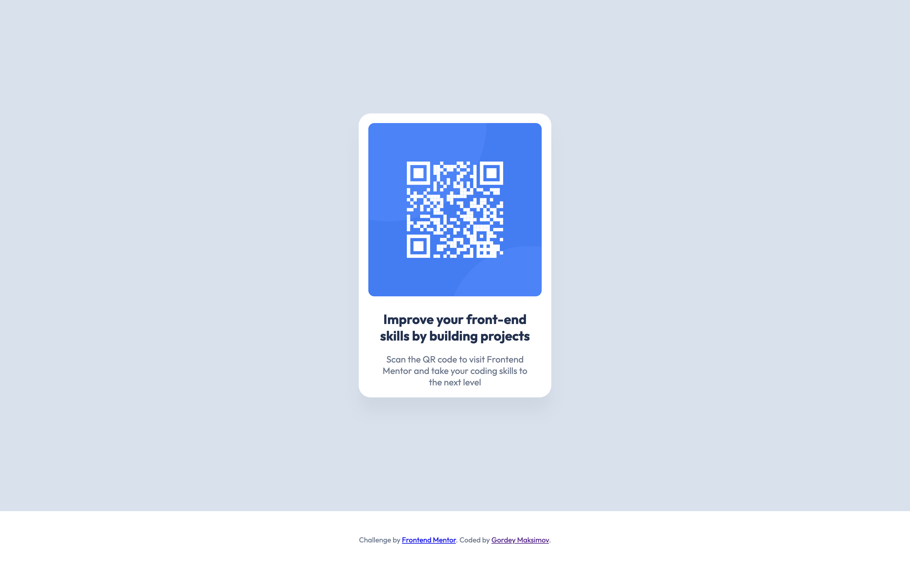

# Frontend Mentor - QR code component solution

This is a solution to the [QR code component challenge on Frontend Mentor](https://www.frontendmentor.io/challenges/qr-code-component-iux_sIO_H).

## Table of contents

-   [Overview](#overview)
    -   [Screenshot](#screenshot)
    -   [Links](#links)
-   [My process](#my-process)
    -   [Built with](#built-with)
    -   [What I learned](#what-i-learned)
    -   [Continued development](#continued-development)
    -   [Useful resources](#useful-resources)
-   [Author](#author)
-   [Acknowledgments](#acknowledgments)

## Overview

This is my first element of layout practice, for which I decided to use Frontend Mentor. It's a simple component with a QR code, which I wrote in literally 10-15 minutes.

### Screenshot

### Links

-   Live Site URL: (https://golz29.github.io/qr-code-component/)

## My process

### Built with

-   Semantic HTML5 markup
-   CSS custom properties
-   Flexbox

## Author

-   Frontend Mentor - [@golz29](https://www.frontendmentor.io/profile/golz29)
-   VK - [@golz29](https://vk.com/golz29)
